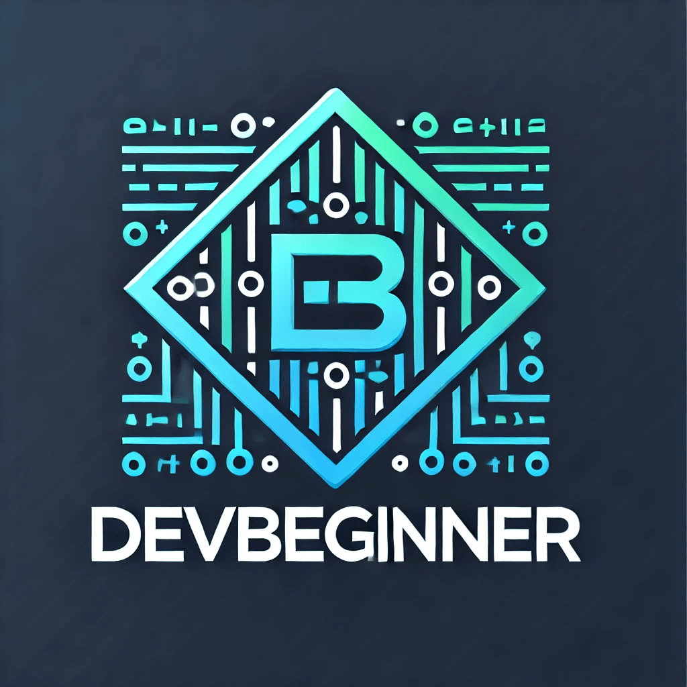
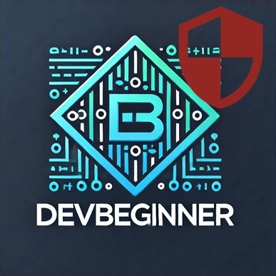

  

## Hallo! 👋
Willkommen auf meinem GitHub-Profil!
 
Ich bin ein leidenschaftlicher 🚀Full-Stack-Entwickler mit Erfahrung in JavaScript, Node.js und SQL für Web-Backends sowie Java für Desktop- und Lernprojekte. 
Am liebsten arbeite ich an modernen Webprojekten, erstelle aber auch Automatisierungen und Skripte mit Bash und PowerShell, um wiederkehrende Aufgaben effizient zu erledigen.

  

---

## 👉 Hinweis
Die meisten meiner Projekte auf GitHub sind speziell für die mobile Nutzung (Smartphones) konzipiert.

---

## Frontend

  
  
  

---

## Backend

  
  
  

---

## 🛠 Tools & Workflow

  
  
  
  

  
  

  

  
  
  

  

---

## Gründer von DevBeginner 💻
<table>
  <tr>
    <td align="center">
      
       
      <b><a href="https://devbeginner.free.nf">DevBeginner</a></b>
    </td>
    <td align="center">
      
       
      <b><a href="https://devbeginner-hacken-lernen.free.nf">Hacken lernen</a></b>
    </td>
  </tr>
</table>

---

## 🔧 Meine GitHub-Statistiken

 

---

## 📫 Kontakt & Socials
- 📧 Mail: [nils.programmierer@gmail.com](mailto:nils.programmierer@gmail.com)
- 🌐 Portfolio: [https://nils-programmierer.free.nf](https://nils-programmierer.free.nf)
