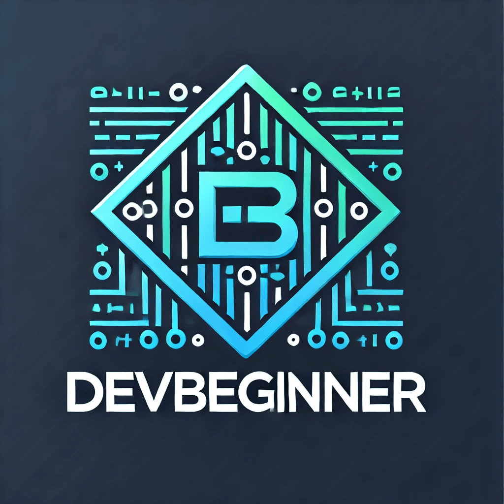

  

## Hallo! 👋
Willkommen auf meinem GitHub-Profil!
 
Ich bin ein leidenschaftlicher 🚀Full-Stack-Entwickler mit Erfahrung in Java, JavaScript, Node.js und SQL.
Ich arbeite gerne an vielseitigen Projekten – von Backend-Systemen bis zu modernen Webanwendungen.

  

---

## 👉 Hinweis
Die meisten meiner Projekte auf GitHub sind speziell für die mobile Nutzung (Smartphones & Tablets) konzipiert – mit Fokus auf Performance und Benutzerfreundlichkeit auf kleinen Bildschirmen.

---

## Frontend

  
  
  

---

## Backend

  
  
  
  

---

## Gründer von DevBeginner 💻

 
<b><a href="https://devbeginner.free.nf">https://devbeginner.free.nf</a></b>

---

## 🔧 Meine GitHub-Statistiken

 

---

## 📫 Kontakt & Socials
- 📧 Mail: [nils.programmierer@gmail.com](mailto:nils.programmierer@gmail.com)
- 🌐 Portfolio: [https://nils-programmierer.free.nf/](https://nils-programmierer.free.nf/)
